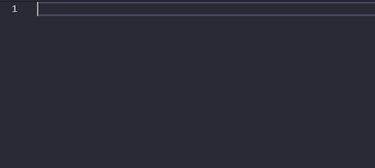

# DAY4_Homework

## Auto Close Tag

저는 VScode의 확장툴로서 Auto Close Tag를 고유하고자 합니다.

Auto Close Tag HTML코드의 시작 Tag ```<>```만 입력을 하면 자동으로 닫히는 Tag```</>```를 작성해주는 확장 툴입니다.

아래 보이는 것 처럼  
```html
    <html>
        <ul>
            <button>
                <style>
```
단순히 시작 Tag만 입력을 하게된다면 닫히는 Tag가 작성됩니다.


> 설치는 왼쪽의 Extensions바를 누르거나 단축키 **Ctrl+Shifit+X** 를 눌러 Auto Close Tag를 입력후 설치하면 됩니다.


이 툴을 사용하게 되면 시작 Tag ```<>```와 닫히는 Tag ```</>``` 빈번하게 사용하는 HTML 코드 에서 글자 입력수를 줄일 수 있고 이는 코딩 시간을 획기적으로 단축 시킬 수 있습니다.